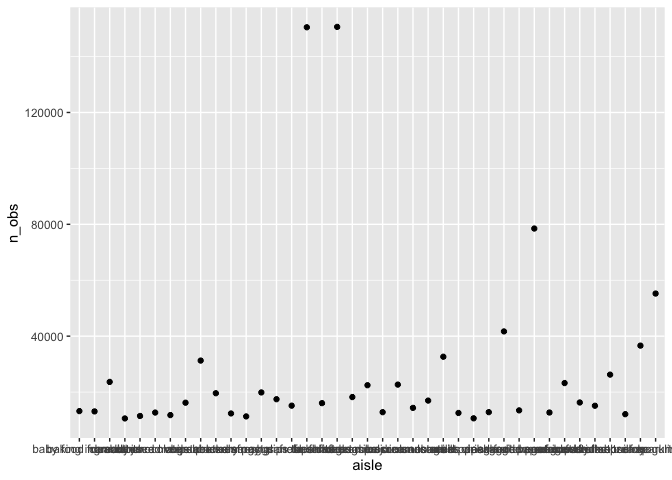

p8105_hw3_yl4610
================
Yuxin Liu
2022-10-08

``` r
library(tidyverse)
```

    ## ── Attaching packages ─────────────────────────────────────── tidyverse 1.3.2 ──
    ## ✔ ggplot2 3.3.6      ✔ purrr   0.3.4 
    ## ✔ tibble  3.1.8      ✔ dplyr   1.0.10
    ## ✔ tidyr   1.2.0      ✔ stringr 1.4.1 
    ## ✔ readr   2.1.2      ✔ forcats 0.5.2 
    ## ── Conflicts ────────────────────────────────────────── tidyverse_conflicts() ──
    ## ✖ dplyr::filter() masks stats::filter()
    ## ✖ dplyr::lag()    masks stats::lag()

``` r
library(p8105.datasets)
```

# question 1

``` r
data("instacart") 
janitor::clean_names(instacart)
```

    ## # A tibble: 1,384,617 × 15
    ##    order_id product_id add_to_…¹ reord…² user_id eval_…³ order…⁴ order…⁵ order…⁶
    ##       <int>      <int>     <int>   <int>   <int> <chr>     <int>   <int>   <int>
    ##  1        1      49302         1       1  112108 train         4       4      10
    ##  2        1      11109         2       1  112108 train         4       4      10
    ##  3        1      10246         3       0  112108 train         4       4      10
    ##  4        1      49683         4       0  112108 train         4       4      10
    ##  5        1      43633         5       1  112108 train         4       4      10
    ##  6        1      13176         6       0  112108 train         4       4      10
    ##  7        1      47209         7       0  112108 train         4       4      10
    ##  8        1      22035         8       1  112108 train         4       4      10
    ##  9       36      39612         1       0   79431 train        23       6      18
    ## 10       36      19660         2       1   79431 train        23       6      18
    ## # … with 1,384,607 more rows, 6 more variables: days_since_prior_order <int>,
    ## #   product_name <chr>, aisle_id <int>, department_id <int>, aisle <chr>,
    ## #   department <chr>, and abbreviated variable names ¹​add_to_cart_order,
    ## #   ²​reordered, ³​eval_set, ⁴​order_number, ⁵​order_dow, ⁶​order_hour_of_day

I loaded the libraries and data from the p8105.datasets. Then I used
janitor to clean the names. This dataset contains variables such as
order_id, product_id, add_to_cart_order, reordered, user_id, eval_set,
order_number, order_dow, order_hour_of_day, days_since_prior_order,
product_name, aisle_id, department_id, aisle, department. It contains 15
columns and 1384617 rows.

``` r
instacart %>%
  group_by(aisle) %>%
  summarize(n_obs = n())%>%
  arrange(desc(n_obs)) %>%
  filter(n_obs > 10000) %>% 
  ggplot(aes(x=aisle, y = n_obs)) + geom_point() 
```

<!-- -->
There are 134 aisles and fresh vegetables are the most items ordered
from. I used group_by and summarize to look at the number of aisles and
then used arrange to arrange the number from largest to smallest. I used
filter to limit number of items to aisles with more than 10000 items
ordered by. I used ggplot to make a scatterplot to show the number of
items ordered in each aisle.

Make a plot that shows the number of items ordered in each aisle,
limiting this to aisles with more than 10000 items ordered. Arrange
aisles sensibly, and organize your plot so others can read it. Make a
table showing the three most popular items in each of the aisles “baking
ingredients”, “dog food care”, and “packaged vegetables fruits”. Include
the number of times each item is ordered in your table. Make a table
showing the mean hour of the day at which Pink Lady Apples and Coffee
Ice Cream are ordered on each day of the week; format this table for
human readers (i.e. produce a 2 x 7 table).

# question 2

``` r
accel_data = read_csv( "./dataset/accel_data.csv") %>%
janitor::clean_names() %>% 
mutate (
  weekday_vs_weekend = ifelse(day %in% c("Saturday", "Sunday"), 0, 1)
  ) %>%
  pivot_longer(
    activity_1:activity_1440,
    names_to = "activity",
    names_prefix = "activity_", 
    values_to = "activity_counts") 
```

    ## Rows: 35 Columns: 1443
    ## ── Column specification ────────────────────────────────────────────────────────
    ## Delimiter: ","
    ## chr    (1): day
    ## dbl (1442): week, day_id, activity.1, activity.2, activity.3, activity.4, ac...
    ## 
    ## ℹ Use `spec()` to retrieve the full column specification for this data.
    ## ℹ Specify the column types or set `show_col_types = FALSE` to quiet this message.

``` r
accel_data 
```

    ## # A tibble: 50,400 × 6
    ##     week day_id day    weekday_vs_weekend activity activity_counts
    ##    <dbl>  <dbl> <chr>               <dbl> <chr>              <dbl>
    ##  1     1      1 Friday                  1 1                   88.4
    ##  2     1      1 Friday                  1 2                   82.2
    ##  3     1      1 Friday                  1 3                   64.4
    ##  4     1      1 Friday                  1 4                   70.0
    ##  5     1      1 Friday                  1 5                   75.0
    ##  6     1      1 Friday                  1 6                   66.3
    ##  7     1      1 Friday                  1 7                   53.8
    ##  8     1      1 Friday                  1 8                   47.8
    ##  9     1      1 Friday                  1 9                   55.5
    ## 10     1      1 Friday                  1 10                  43.0
    ## # … with 50,390 more rows

I used read_csv to read dataset and used janitor to clean the names of
data. Then I used mutate to create the new variable weekday_vs_weekend
by using ifelse. If day equals to Saturday or Sunday, weekday_vs_weekend
equals to 0; If day equals to weekdays, weekday_vs_weekend equals to 1.
I used pivot_longer to pivot the categories of activities into one
column and pivot corresponding values to activity_counts. I also used
names_to to dropped the prefix activity\_ to make it cleaner.

This dataset contains variables such as week, day_id, day,
weekday_vs_weekend, activity, activity_counts. It contains 6 columns and
50400 rows. Thus, there are 50400 observations.

``` r
accel_data %>%
  group_by (day, day_id) %>%
  summarise (
  activity_total = sum(activity_counts)) %>%
  arrange(desc(activity_total)) %>%
  knitr::kable() 
```

    ## `summarise()` has grouped output by 'day'. You can override using the `.groups`
    ## argument.

| day       | day_id | activity_total |
|:----------|-------:|---------------:|
| Monday    |     16 |      685910.00 |
| Sunday    |      4 |      631105.00 |
| Friday    |     29 |      620860.00 |
| Saturday  |     10 |      607175.00 |
| Friday    |      8 |      568839.00 |
| Thursday  |     33 |      549658.00 |
| Friday    |      1 |      480542.62 |
| Thursday  |     12 |      474048.00 |
| Wednesday |     21 |      468869.00 |
| Friday    |     15 |      467420.00 |
| Sunday    |     18 |      467052.00 |
| Wednesday |     35 |      445366.00 |
| Wednesday |     14 |      440962.00 |
| Wednesday |     28 |      434460.00 |
| Tuesday   |     13 |      423245.00 |
| Sunday    |     11 |      422018.00 |
| Monday    |     23 |      409450.00 |
| Monday    |     30 |      389080.00 |
| Saturday  |     17 |      382928.00 |
| Tuesday   |     20 |      381507.00 |
| Saturday  |      3 |      376254.00 |
| Thursday  |     19 |      371230.00 |
| Tuesday   |     34 |      367824.00 |
| Thursday  |      5 |      355923.64 |
| Thursday  |     26 |      340291.00 |
| Wednesday |      7 |      340115.01 |
| Tuesday   |     27 |      319568.00 |
| Tuesday   |      6 |      307094.24 |
| Monday    |      9 |      295431.00 |
| Sunday    |     25 |      260617.00 |
| Friday    |     22 |      154049.00 |
| Sunday    |     32 |      138421.00 |
| Monday    |      2 |       78828.07 |
| Saturday  |     24 |        1440.00 |
| Saturday  |     31 |        1440.00 |

mutate( day = forcats::fct_relevel(day, c(“Monday”, “Tuesday”,
“Wednesday”, “Thursday”, “Friday”, “Saturday”, “Sunday”)))

I used group_by to make groupings explicit so that they can be included
in subsequent operations. Then I used summarise to create a total
activity variable for each day by aggregating across minutes via sum
function. I used arrange to rank the activity_total from highest to
lowest. I used knitr::kable to create a table in rmd file.

Are any trends apparent?

``` r
accel_data %>%
  ggplot(aes(x = activity_counts, y = day_id, color = day)) + 
  geom_point(alpha = 0.5) + 
    labs( 
    title = "24-hour activity time courses for each day",
    x = "minute",
    y = "day") 
```

<!-- --> I
used ggplot to create a scatterplot to show the 24-hour activity time
courses for each day. I used color = day to indicate day of the week. I
used labs to add title, x-axis label, and y-axis label. Describe in
words any patterns or conclusions you can make based on this graph.

# question3

``` r
data("ny_noaa") 
```

I loaded ny_noaa dataset from the p8105.datasets library and renamed it
as noaa_df. This dataset contains variables such as id, date, prcp,
snow, snwd, tmax, tmin. It contains 7 columns and 2595176 rows. Thus,
there are 2595176 observations. missing data is an issue
