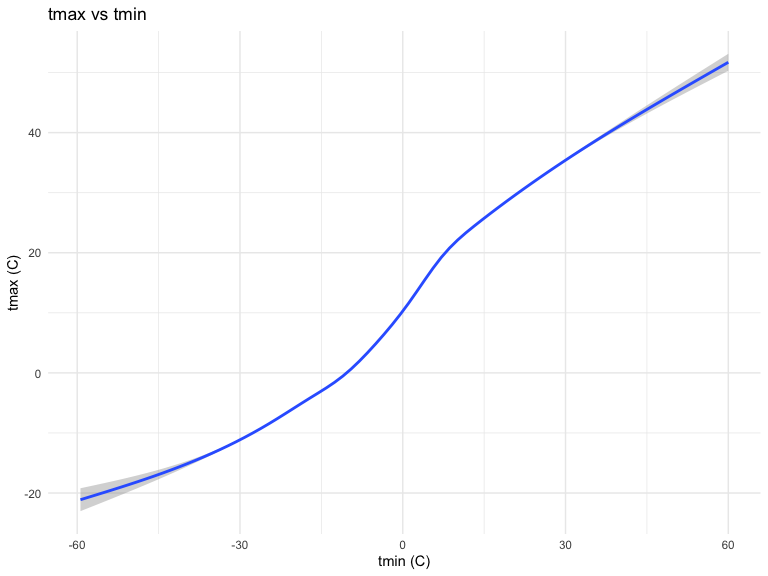

p8105_hw3_yl4610
================
Yuxin Liu
2022-10-08

``` r
library(tidyverse)
library(ggridges)
library(patchwork)

library(p8105.datasets)

knitr::opts_chunk$set(
    echo = TRUE,
    warning = FALSE,
    fig.width = 8, 
  fig.height = 6,
  out.width = "90%"
)

theme_set(theme_minimal() + theme(legend.position = "bottom"))

options(
  ggplot2.continuous.colour = "viridis",
  ggplot2.continuous.fill = "viridis"
)

scale_colour_discrete = scale_colour_viridis_d
scale_fill_discrete = scale_fill_viridis_d
```

# question 1

``` r
data("instacart") 
janitor::clean_names(instacart)
```

    ## # A tibble: 1,384,617 × 15
    ##    order_id product_id add_to_…¹ reord…² user_id eval_…³ order…⁴ order…⁵ order…⁶
    ##       <int>      <int>     <int>   <int>   <int> <chr>     <int>   <int>   <int>
    ##  1        1      49302         1       1  112108 train         4       4      10
    ##  2        1      11109         2       1  112108 train         4       4      10
    ##  3        1      10246         3       0  112108 train         4       4      10
    ##  4        1      49683         4       0  112108 train         4       4      10
    ##  5        1      43633         5       1  112108 train         4       4      10
    ##  6        1      13176         6       0  112108 train         4       4      10
    ##  7        1      47209         7       0  112108 train         4       4      10
    ##  8        1      22035         8       1  112108 train         4       4      10
    ##  9       36      39612         1       0   79431 train        23       6      18
    ## 10       36      19660         2       1   79431 train        23       6      18
    ## # … with 1,384,607 more rows, 6 more variables: days_since_prior_order <int>,
    ## #   product_name <chr>, aisle_id <int>, department_id <int>, aisle <chr>,
    ## #   department <chr>, and abbreviated variable names ¹​add_to_cart_order,
    ## #   ²​reordered, ³​eval_set, ⁴​order_number, ⁵​order_dow, ⁶​order_hour_of_day

I loaded the libraries and data from the p8105.datasets. Then I used
janitor to clean the names. This dataset contains variables such as
order_id, product_id, add_to_cart_order, reordered, user_id, eval_set,
order_number, order_dow, order_hour_of_day, days_since_prior_order,
product_name, aisle_id, department_id, aisle, department. It contains 15
columns and 1384617 rows, with each row representing a single product
from an instacart order.

Variables include identifiers for user, order, and product; the order in
which each product was added to the cart. There are several order-level
variables, describing the day and time of the order, and number of days
since prior order. Then there are several item-specific variables,
describing the product name (e.g. Yogurt, Avocado), department
(e.g. dairy and eggs, produce), and aisle (e.g. yogurt, fresh fruits),
and whether the item has been ordered by this user in the past. In
total, there are 39123 products found in 131209 orders from 131209
distinct users.

Below is a table summarizing the number of items ordered from aisle. In
total, there are 134 aisles, with fresh vegetables and fresh fruits
holding the most items ordered by far.

``` r
instacart %>% 
  count(aisle) %>% 
  arrange(desc(n))
```

    ## # A tibble: 134 × 2
    ##    aisle                              n
    ##    <chr>                          <int>
    ##  1 fresh vegetables              150609
    ##  2 fresh fruits                  150473
    ##  3 packaged vegetables fruits     78493
    ##  4 yogurt                         55240
    ##  5 packaged cheese                41699
    ##  6 water seltzer sparkling water  36617
    ##  7 milk                           32644
    ##  8 chips pretzels                 31269
    ##  9 soy lactosefree                26240
    ## 10 bread                          23635
    ## # … with 124 more rows

I used count to look at the number of aisles and then used arrange to
arrange the number from largest to smallest.

Next is a plot that shows the number of items ordered in each aisle.
Here, aisles are ordered by ascending number of items.

``` r
instacart %>% 
  count(aisle) %>% 
  filter(n > 10000) %>% 
  mutate(aisle = fct_reorder(aisle, n)) %>% 
  ggplot(aes(x = aisle, y = n)) + 
  geom_point() + 
  labs(title = "Number of items ordered in each aisle") +
  theme(axis.text.x = element_text(angle = 60, hjust = 1))
```


I used filter to limit this to aisles with more than 10000 items
ordered.Then I used mutate and fct_reorder to arrange aisles sensibly
and used ggplot to create the plot that shows the number of items
ordered in each aisle.

Our next table shows the three most popular items in aisles
`baking ingredients`, `dog food care`, and `packaged vegetables fruits`,
and includes the number of times each item is ordered in your table.

``` r
instacart %>% 
  filter(aisle %in% c("baking ingredients", "dog food care", "packaged vegetables fruits")) %>%
  group_by(aisle) %>% 
  count(product_name) %>% 
  mutate(rank = min_rank(desc(n))) %>% 
  filter(rank < 4) %>% 
  arrange(desc(n)) %>%
  knitr::kable()
```

| aisle                      | product_name                                  |    n | rank |
|:---------------------------|:----------------------------------------------|-----:|-----:|
| packaged vegetables fruits | Organic Baby Spinach                          | 9784 |    1 |
| packaged vegetables fruits | Organic Raspberries                           | 5546 |    2 |
| packaged vegetables fruits | Organic Blueberries                           | 4966 |    3 |
| baking ingredients         | Light Brown Sugar                             |  499 |    1 |
| baking ingredients         | Pure Baking Soda                              |  387 |    2 |
| baking ingredients         | Cane Sugar                                    |  336 |    3 |
| dog food care              | Snack Sticks Chicken & Rice Recipe Dog Treats |   30 |    1 |
| dog food care              | Organix Chicken & Brown Rice Recipe           |   28 |    2 |
| dog food care              | Small Dog Biscuits                            |   26 |    3 |

I used filter to filter three most popular items in each of the aisles
“baking ingredients”, “dog food care”, and “packaged vegetables fruits”.
I used count to include the number of times each item is ordered and
used mutate to rank them in order. I used arrange to rank the value from
highest to lowest.I used knitr::kable to create a table in rmd file.

Finally is a table showing the mean hour of the day at which Pink Lady
Apples and Coffee Ice Cream are ordered on each day of the week. This
table has been formatted in an untidy manner for human readers. Pink
Lady Apples are generally purchased slightly earlier in the day than
Coffee Ice Cream, with the exception of day 5.

``` r
instacart %>%
  filter(product_name %in% c("Pink Lady Apples", "Coffee Ice Cream")) %>%
  group_by(product_name, order_dow) %>%
  summarize(mean_hour = mean(order_hour_of_day)) %>%
  spread(key = order_dow, value = mean_hour) %>%
  knitr::kable(digits = 2)
```

    ## `summarise()` has grouped output by 'product_name'. You can override using the
    ## `.groups` argument.

| product_name     |     0 |     1 |     2 |     3 |     4 |     5 |     6 |
|:-----------------|------:|------:|------:|------:|------:|------:|------:|
| Coffee Ice Cream | 13.77 | 14.32 | 15.38 | 15.32 | 15.22 | 12.26 | 13.83 |
| Pink Lady Apples | 13.44 | 11.36 | 11.70 | 14.25 | 11.55 | 12.78 | 11.94 |

I used filter to filter Pink Lady Apples and Coffee Ice Cream. I used
group_by to group them by product_name and order_dow. Then I used
summarize to calculate mean hour of the day at which Pink Lady Apples
and Coffee Ice Cream are ordered on each day of the week. I used spread
to format the table for human readers. Lastly, I used knitr::kable to
create a table in rmd file.

# question 2

``` r
accel_data = read_csv( "./dataset/accel_data.csv") %>%
janitor::clean_names() %>% 
mutate (
  weekday_vs_weekend = ifelse(day %in% c("Saturday", "Sunday"), 0, 1),
  weekday_vs_weekend = as.factor (weekday_vs_weekend)
  ) %>%
  pivot_longer(
    activity_1:activity_1440,
    names_to = "activity",
    names_prefix = "activity_", 
    values_to = "activity_counts") 
```

    ## Rows: 35 Columns: 1443
    ## ── Column specification ────────────────────────────────────────────────────────
    ## Delimiter: ","
    ## chr    (1): day
    ## dbl (1442): week, day_id, activity.1, activity.2, activity.3, activity.4, ac...
    ## 
    ## ℹ Use `spec()` to retrieve the full column specification for this data.
    ## ℹ Specify the column types or set `show_col_types = FALSE` to quiet this message.

``` r
accel_data 
```

    ## # A tibble: 50,400 × 6
    ##     week day_id day    weekday_vs_weekend activity activity_counts
    ##    <dbl>  <dbl> <chr>  <fct>              <chr>              <dbl>
    ##  1     1      1 Friday 1                  1                   88.4
    ##  2     1      1 Friday 1                  2                   82.2
    ##  3     1      1 Friday 1                  3                   64.4
    ##  4     1      1 Friday 1                  4                   70.0
    ##  5     1      1 Friday 1                  5                   75.0
    ##  6     1      1 Friday 1                  6                   66.3
    ##  7     1      1 Friday 1                  7                   53.8
    ##  8     1      1 Friday 1                  8                   47.8
    ##  9     1      1 Friday 1                  9                   55.5
    ## 10     1      1 Friday 1                  10                  43.0
    ## # … with 50,390 more rows

I used read_csv to read dataset and used janitor to clean the names of
data. Then I used mutate to create the new variable weekday_vs_weekend
by using ifelse. If day equals to Saturday or Sunday, weekday_vs_weekend
equals to 0; If day equals to weekdays, weekday_vs_weekend equals to 1.
Then I used mutate to convert them to factors. I used pivot_longer to
pivot the categories of activities into one column and pivot
corresponding values to activity_counts. I also used names_to to dropped
the prefix activity\_ to make it cleaner.

This dataset contains variables such as week, day_id, day,
weekday_vs_weekend, activity, activity_counts. It contains 6 columns and
50400 rows. Thus, there are 50400 observations.

``` r
accel_data %>%
  group_by (week, day) %>%
  summarise (
  activity_total = sum(activity_counts)) %>%
  pivot_wider (
    names_from = "day",
    values_from = "activity_total")%>% 
  select (Monday, Tuesday, Wednesday, Thursday, Friday, Saturday, Sunday) %>% 
  knitr::kable() 
```

    ## `summarise()` has grouped output by 'week'. You can override using the
    ## `.groups` argument.
    ## Adding missing grouping variables: `week`

| week |    Monday |  Tuesday | Wednesday | Thursday |   Friday | Saturday | Sunday |
|-----:|----------:|---------:|----------:|---------:|---------:|---------:|-------:|
|    1 |  78828.07 | 307094.2 |    340115 | 355923.6 | 480542.6 |   376254 | 631105 |
|    2 | 295431.00 | 423245.0 |    440962 | 474048.0 | 568839.0 |   607175 | 422018 |
|    3 | 685910.00 | 381507.0 |    468869 | 371230.0 | 467420.0 |   382928 | 467052 |
|    4 | 409450.00 | 319568.0 |    434460 | 340291.0 | 154049.0 |     1440 | 260617 |
|    5 | 389080.00 | 367824.0 |    445366 | 549658.0 | 620860.0 |     1440 | 138421 |

I used group_by to make groupings explicit so that they can be included
in subsequent operations. Then I used summarise to create a total
activity variable for each day by aggregating across minutes via sum
function. Then, I used pivot_wider in order to better see the data and
used select to reorder from Monday to Sunday. I used knitr::kable to
create a table in rmd file.

This person had extreme low level of activities on Saturday at week 4
and week 5. Also, this person has relatively lower level of activities
on week 1 Monday (\<10,0000) comapred to other weekdays. Other than
this, I do not think there are other apparent trends.

``` r
accel_data_plot=
accel_data %>%
  ggplot(aes(x = activity, y = activity_counts, color = day)) + 
  geom_line(alpha = 0.5) + 
  geom_smooth(se = FALSE)+
  scale_x_discrete(
    breaks = c(0, 240, 480, 720, 960,1200,1440), 
    labels = c("12:00 A.M.","04:00 A.M.","8:00 A.M.","12:00 P.M.","04:00 P.M.","8:00 P.M.","12:00 P.M."))+
  labs( 
    title = "24-hour activity time courses for each day",
    x = "minute",
    y = "day") +
    geom_smooth(alpha = 0.5)
accel_data_plot
```

    ## `geom_smooth()` using method = 'loess' and formula 'y ~ x'
    ## `geom_smooth()` using method = 'loess' and formula 'y ~ x'


Based on this graph, this 63 year-old male had a higher level of
activities in weekdays compared to weekends generally. He has higher
level of activities around 8 P.M., 12 P.M., and 4P.M. He has lower level
of activities around 12 A.M. and 4 A.M.

# question3

``` r
data("ny_noaa") 
ny_noaadf = 
ny_noaa %>%
janitor::clean_names() %>% 
  mutate (tmax = as.integer(tmax),
          tmin = as.integer(tmin)) %>% 
separate(date, into = c("year", "month", "day"), sep = "-") %>% 
  mutate (
      month = as.integer(month),
      day = as.integer(day)) %>% 
  mutate (
    prcp = prcp/10,
    tmax = tmax/10,
    tmin = tmin/10)
```

I loaded ny_noaa dataset from the p8105.datasets library. This dataset
contains variables such as id, date, prcp, snow, snwd, tmax, tmin. It
contains 7 columns and 2595176 rows. Thus, there are 2595176
observations.

Precipitation, tmax, and tmin are divided by 10. prec: Precipitation has
145838 missing values snow: Snowfall has 381221 missing values snwd:
Snow depth variable has 591786 missing values tmin: Minimum temperature
has 1134420 missing values tmax: Maximum temperature has 1134358 missing
values

Missing data is a big issue here because we have a lot of them.

``` r
ny_noaadf %>% 
  group_by(snow) %>% 
    summarize(
    n_obs = n()) %>% 
arrange(desc(n_obs))
```

    ## # A tibble: 282 × 2
    ##     snow   n_obs
    ##    <int>   <int>
    ##  1     0 2008508
    ##  2    NA  381221
    ##  3    25   31022
    ##  4    13   23095
    ##  5    51   18274
    ##  6    76   10173
    ##  7     8    9962
    ##  8     5    9748
    ##  9    38    9197
    ## 10     3    8790
    ## # … with 272 more rows

The most commonly observed values for snow is 0 because it has 2008508
observations.Most of the time we do not have snow due to weather and
seasons.

Two-panel plot showing the average max temperature in January and in
July in each station across years:

``` r
ny_plot1 = 
ny_noaadf %>%
mutate(month = month.name[month]) %>% 
filter(month %in% c("January","July")) %>% 
group_by(id, year, month) %>% 
summarize(
average_max_temp = mean(tmax, na.rm = TRUE)) %>% 
  ggplot(
  aes(x = year, y = average_max_temp)) +
  geom_point(alpha = 0.5, size = .1) +
  geom_smooth(aes(group=month)) +
      labs( 
    title = "average max temperature in January and in July in each station across years",
    x = "year",
    y = "average_max_temp (C)")+
  facet_grid(.~month)
```

    ## `summarise()` has grouped output by 'id', 'year'. You can override using the
    ## `.groups` argument.

``` r
ny_plot1
```

    ## `geom_smooth()` using method = 'gam' and formula 'y ~ s(x, bs = "cs")'


The average max temperature in January is lower than the average max
temperature in July in each station across year. Also, the range of
average max temperature in January is greater than that in July.Yes,
there are outliers.

Make a two-panel plot showing (i) tmax vs tmin for the full dataset
(note that a scatterplot may not be the best option); and (ii) make a
plot showing the distribution of snowfall values greater than 0 and less
than 100 separately by year

``` r
ny_ploti =
  ny_noaadf %>%
  ggplot(
  aes(x = tmin, y = tmax)) +
  geom_smooth() +     
labs( 
    title = "tmax vs tmin",
    x = "tmin (C)",
    y = "tmax (C)")
ny_ploti
```

    ## `geom_smooth()` using method = 'gam' and formula 'y ~ s(x, bs = "cs")'


The distribution of the plot is not linear, but there exists a postive
relationship between tmin and tmax.

``` r
ny_plotii =
  ny_noaadf %>%
  filter(snow>0 & snow<100) %>% 
  ggplot(aes(x = snow, fill = year)) +
  geom_density(alpha = .4, adjust = .5, color = "blue") +     
labs( 
    title = "distribution of snowfall separately by year")
ny_plotii
```


The distribution of snowfall are pretty similar each year after we only
include 0\<snow\<100.

merge the two plots together to create a two-panel plot

``` r
ny_ploti + ny_plotii
```

    ## `geom_smooth()` using method = 'gam' and formula 'y ~ s(x, bs = "cs")'


